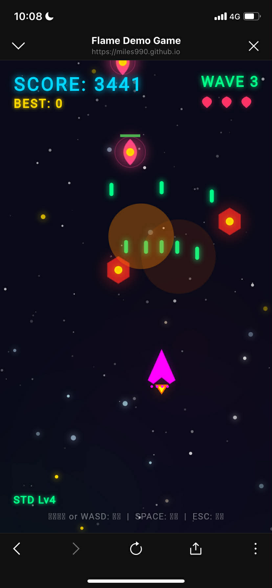

# Space Shooter

A retro-style arcade space shooting game built with **Flutter** and **Flame Engine**.

> **Built with AI**: This game was developed using [self-evolving-agent](https://github.com/miles990/self-evolving-agent)'s `/evolve` skill - an autonomous AI agent that learns and iterates until goals are achieved.

## Play Now

[Play Space Shooter](https://miles990.github.io/flame_demo_game/)

## Screenshots



## Features

### Weapon System (5 Types × 4 Levels)

| Type | Color | Special Ability |
|------|-------|-----------------|
| Standard | Green | Balanced power |
| Spread | Yellow-Green | Wide coverage |
| Laser | Cyan | Piercing (hits multiple enemies) |
| Missile | Orange | Homing (tracks enemies) |
| Plasma | Purple | High damage |

Each weapon has 4 upgrade levels increasing bullet count and power.

### Power-ups (12 Types)

#### Basic Power-ups (20% drop rate)
| Item | Color | Effect |
|------|-------|--------|
| Weapon Upgrade (W) | Orange | Level up current weapon |
| Shield (S) | Blue | 8s protection |
| Rapid Fire (R) | Purple | 5s double fire rate |
| Speed Boost (>) | Yellow | 6s faster movement |
| Bomb (B) | Red | Clear all enemies |
| Extra Life (+) | Green | +1 life |

#### Weapon Type Power-ups
| Item | Color | Effect |
|------|-------|--------|
| Spread (SP) | Yellow-Green | Switch to spread weapon |
| Laser (LA) | Cyan | Switch to laser weapon |
| Missile (MI) | Deep Orange | Switch to missile weapon |
| Plasma (PL) | Violet | Switch to plasma weapon |

#### Formation Bonus
| Item | Color | Effect |
|------|-------|--------|
| Mega Bonus (★) | Gold | +500 score + random power-up |

### Enemy Types (8 Types)

| Type | Shape | Behavior | Spawn Direction |
|------|-------|----------|-----------------|
| Basic | Hexagon (Red) | Sine wave movement | Top |
| Fast | Triangle (Orange) | High-speed straight | Top/Diagonal |
| Tank | Square (Gray) | Slow but 3 HP | Top |
| Shooter | Diamond (Purple) | Fires bullets | Top |
| Zigzag | Star (Cyan) | Side-to-side movement | Top |
| **Tracker** | Pentagon (Pink) | Follows player | Any direction |
| **Diver** | Arrow (Yellow) | Dive attacks | Top |
| **Orbiter** | Circle (Blue) | Orbital movement | Left/Right |

**Spawn Directions**: Top, Left, Right, Top-Left, Top-Right

### Enemy Formations (5 Types)
- **V-Shape**: Classic formation
- **Line**: Horizontal row
- **Circle**: Circular pattern
- **Arrow**: Pointed formation
- **Wave**: Sine wave pattern

**Formation Bonus**: Destroy all enemies in a formation to get guaranteed bonus drops!

### Boss Battles (Enhanced)
- Appears every 5 waves
- **3-Phase difficulty system**:
  - Phase 1 (>70% HP): Basic patterns
  - Phase 2 (40-70% HP): More bullets, faster fire
  - Phase 3 (<40% HP): Enraged mode with spiral attacks
- **Enraged Mode** (<30% HP): Speed boost + aggressive patterns
- Health: 1.5-2x higher than before
- Drops 3 random power-ups on defeat

## Controls

| Key | Action |
|-----|--------|
| ↑↓←→ / WASD | Move |
| SPACE | Shoot |
| ESC | Pause |

## How This Game Was Built

This project demonstrates **AI-assisted game development** using the self-evolving-agent workflow:

### Step 1: Create Domain Skill
First, a [Flame Engine skill](./skills/flame-game-dev/SKILL.md) was created based on the [Flame Engine documentation](https://github.com/flame-engine/flame). This skill encapsulates:
- Flame architecture patterns (FlameGame, Components, World/Camera)
- Input handling (keyboard, touch, joystick)
- Collision detection system
- Sprite animation patterns
- Audio integration
- Common game patterns (object pooling, spawners, parallax)

### Step 2: Evolve the Game
With the Flame skill in place, the `/evolve` command was used to iteratively build the game:

```bash
/evolve 建立一個太空射擊遊戲
/evolve 加入武器升級和道具掉落系統
/evolve 加入多種敵人類型和 Boss
/evolve 部署到 GitHub Pages
```

The self-evolving-agent autonomously:
- Searched memory for relevant patterns
- Applied Flame Engine best practices from the skill
- Implemented features with proper architecture
- Tested and fixed issues iteratively
- Deployed the final product

### Development Time: ~40 minutes (initial) + ~20 minutes (enhancements)

**Initial build** (~40 minutes):
- Game architecture setup
- Player with 4-level weapon system
- 6 types of power-ups with drop system
- 5 enemy types with unique behaviors
- Boss battle system
- Wave progression
- HUD with lives display
- GitHub Pages deployment

**Enhancement update** (~20 minutes):
- 5 weapon types with unique properties
- 3 new enemy types with multi-directional spawning
- Enhanced Boss with 3-phase difficulty
- 12 power-up types
- Formation bonus system

**Bug fixes** (2026-01-13):
- Fixed Bomb power-up not clearing enemies (recursive search for nested components)
- Added visual confirmation flash effect when Bomb triggers

### Why This Approach?

| Traditional | AI-Assisted |
|-------------|-------------|
| Read docs → Write code → Debug | Skill captures expertise → AI applies patterns |
| Manual iteration | Autonomous PDCA cycles |
| Knowledge in developer's head | Knowledge encoded in reusable skills |
| Hours to days | ~40 minutes |

**Skills are "packaged judgment"** - they tell AI when to use what patterns, reducing decision points and ensuring consistency.

## Tech Stack

- **Flutter** 3.x
- **Flame Engine** 1.x
- **Dart** 3.x
- **AI Agent**: [self-evolving-agent](https://github.com/miles990/self-evolving-agent)

## Development

```bash
# Install dependencies
flutter pub get

# Run in development
flutter run -d chrome

# Build for production
flutter build web --release
```

## Deployment

The game is deployed to GitHub Pages using the `gh-pages` branch.

```bash
# Build and deploy
flutter build web --release
# Copy build/web/* to gh-pages branch
```

## License

MIT License

## Credits

- Built with [Flame Engine](https://flame-engine.org/) - A minimalist 2D game engine for Flutter
- Developed using [self-evolving-agent](https://github.com/miles990/self-evolving-agent) - An autonomous AI development workflow
